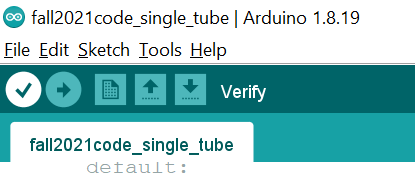
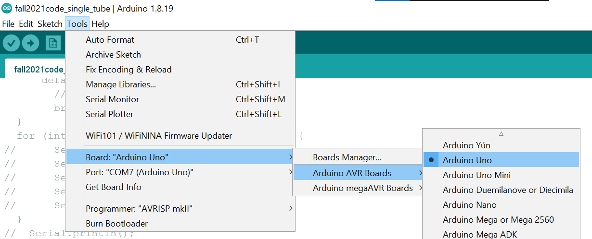
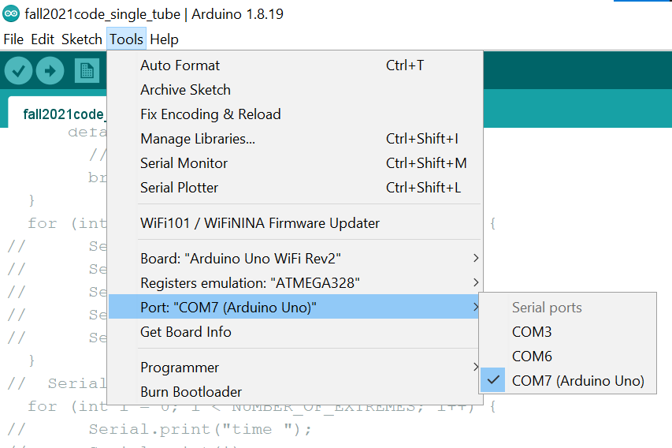
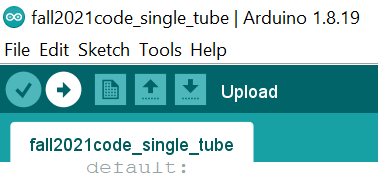

# Arduino Code

## Background

For this project, our group used the following microcontrollers:

1. Arduino UNO

2. Arduino UNO WiFi Rev 2

---

## Uploading code files to Arduino Device

Please see the instructions below for how we uploaded `.ino` code files to the respective Arduino UNO boards:

### Connect the Arduino UNO device to your computer

1. Obtain a **USB-B to USB-A cable**

2. Connect one end to the Arduino UNO's USB-B port

3. Connect the other end to your computer's USB-port

### Uploading files to the Arduino UNO board

#### Arduino UNO

1. Download and install the Arduino IDE from https://www.arduino.cc/en/software

2. Open the Arduino IDE

3. Go to "File > Open" to open a particular file

4. Compile the code using the "Verify" checkmark button near the top of the IDE.

> 

5. Ensure that the Arduino UNO board is plugged into your computer via USB. Please see instructions [here](#Connect-the-Arduino-UNO-device-to-your-computer)

6. Ensure that the correct type of board is configured in the Arduino IDE

7. Go to "Tools > Board > Arduino AVR Boards > Arduino UNO "

> 

8. Ensure that the correct COM port is selected

9. Go to "Tools > Port" and select the Serial port alongside "Arduino UNO" in parentheses. For example, in the picture below, it is "COM7 (Arduino UNO)"

> 

10. Upload the code to the Arduino UNO using the right-arrow upload button at the top of the page.

> 

#### Arduino UNO WiFi

<!-- # Using KiTTY software to save Arduino Serial Monitor output -->
