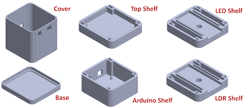
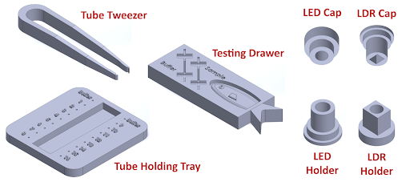
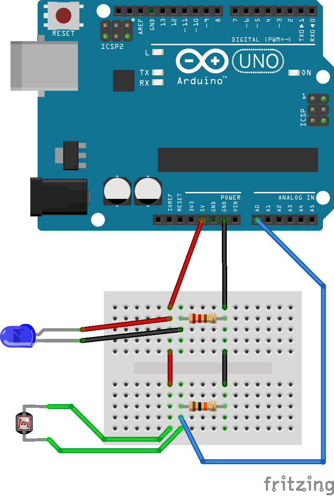
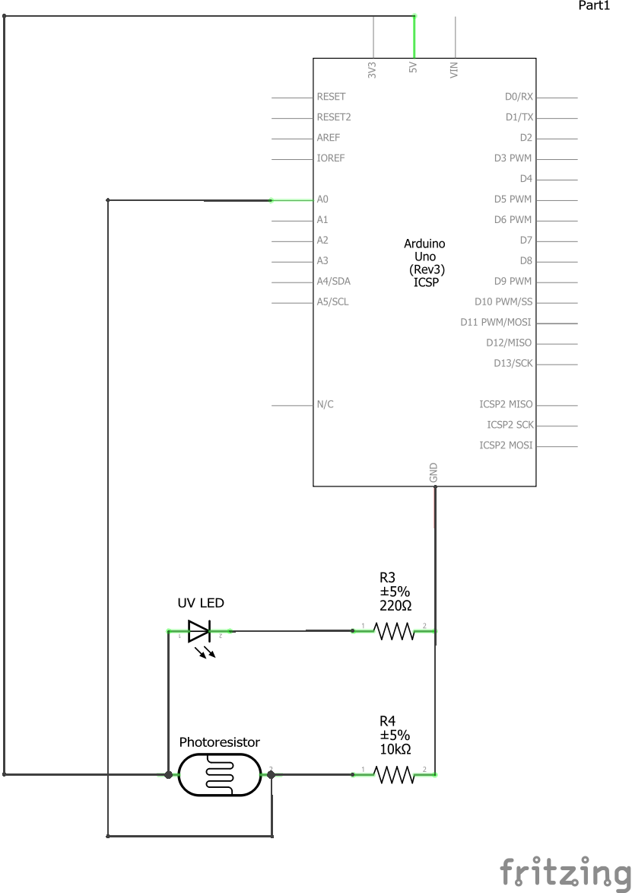

# Assembly Instructions

## Physical Device Assembly

> 

> 

1. Install the Arduino UNO board onto the Arduino shelf, using the provided mounting features.

2. Assemble the breadboard circuit as shown. Our team used 20cm long female-to-male jumper wires in order to connect the LED and light-dependent resistor (LDR).

3. Install jumper wires leading from the breadboard to the Arduino UNO's `5V power`, `ground`, and `A0` ports.

4. First, install the LDR into the LDR Cap, then, assemble with the LDR Holder. Insert this subassembly into the LDR shelf.

5. Assemble the LDR shelf to the top of the Arduino shelf. These parts have asymmetrical mating features so that the parts can only be assembled one way...the right way!

6. First, install the LED into the LED Cap, then, assemble with the LED Holder. Insert this subassembly into the LED shelf.

7. Assemble the LED shelf to the top of the LDR shelf.

8. Assemble the top shelf to the existing assembly.

9. Move the existing assembly to rest on the base piece.

10. Assemble the cover so that it covers the existing assembly and snaps into the base.

11. Get ready to measure concentrations!

## Circuit Assembly

### Circuit Diagram

> 

### Circuit Schematic

> 

### Parts required

1. UV LED (watch out for the direction of the positive lead!)

2. Light-dependent resistor

3. 100-300 Ohm resistor (220 Ohm in our case)

4. 5000-10000 Ohm resistor (10k Ohm in our case)

5. Wires (we used a combination of male-to-male and female-to-male 20cm long jumper wires)

6. Arduino UNO board

7. USB-B to USB-A cable

8. Breadboard (the above diagram is for a mini breadboard, which fits inside the device. However, the circuit may be assembled without the help of a breadboard, so long that the photocell and LED are connected in parallel, as shown in the schematic above.)
