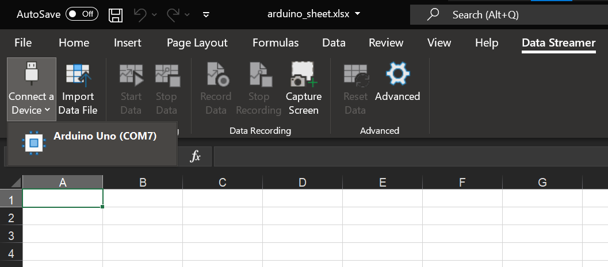
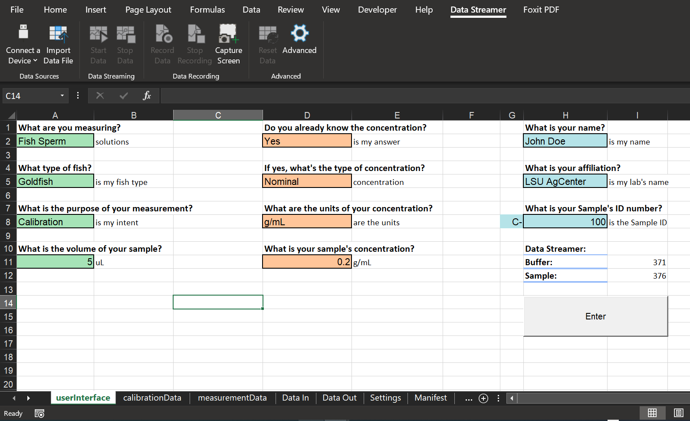
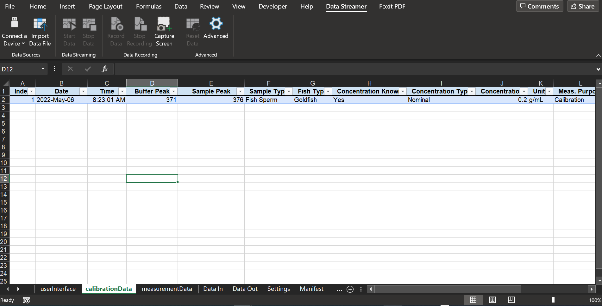
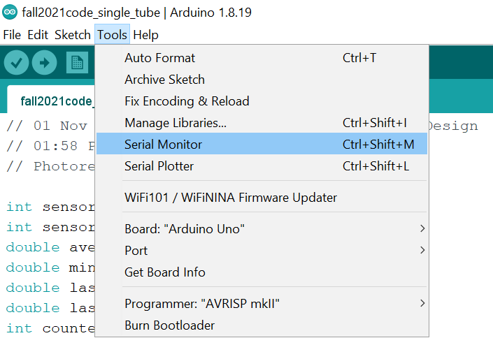
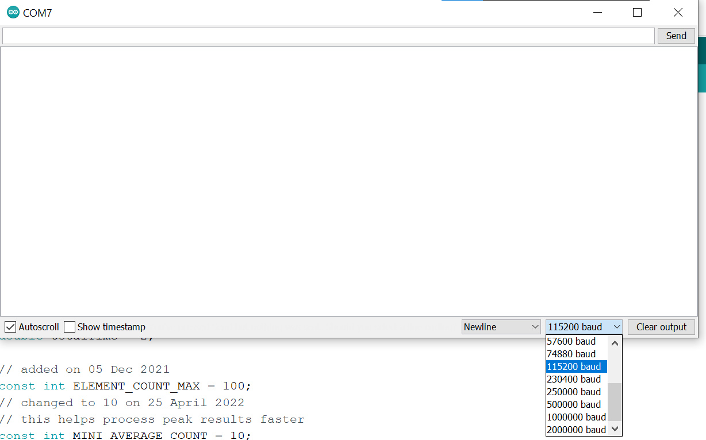

# Usability Instructions

## Preparing the device for measurements

1. Assemble the O.C.E.A.N. device as in the `04 - Assembly Instructions` folder.

2. Obtain glass microcapillary tubes to hold liquid samples. Our team used the following tubes:

    * Name: Drummond Scientific MicroCaps
    * Description: 100 Disposable 5μL micropipettes
    * CAT. No. 1-000-0050
    * Capacity: 5 μL
    * Length (mm): 32
    * Relative O.D.: 0.037 in
    * Relative I.D.: 0.0176 in
    * Manufacturer website: https://www.drummondsci.com/product/capillary-micropipettes/microcaps/

3. Upload the corresponding Arduino code file from the `02 - Arduino UNO code` folder. Instructions for how to upload are explained in the `README` file located in the same folder.

## Taking Measurements

1. Choose a method [here](#Saving-Results) for saving measurement results

2. Load a capillary tube containing your buffer solution into the designated slot on the testing drawer.

3. Load a capillary tube containing your sample into the designated slot.

4. Partially insert the testing drawer into the drawer slot until it does not fall out.

5. Open either the Arduino Serial Monitor or the provided MS Excel file

6. Ensure the Arduino UNO is plugged into the computer

7. Slowly insert the testing drawer into the device for a duration of 10 to 15 seconds. Slowly retract the testing drawer for a duration of 10 to 15 seconds.

8. Record the saved results, which should be in the output format of `Buffer Peak, Sample Peak`

## Saving Results

### MS Excel Data Streamer

1. Please follow the instructions linked below for how to "Enable the Data Streamer add-in" for MS Excel

> https://support.microsoft.com/en-us/office/enable-the-data-streamer-add-in-70052b28-3b00-41e7-8ab6-8a9f142dffeb

2. Download the `doubleTubeSheet.xlsx` file from the `03 - Excel files` folder

3. Open the `doubleTubeSheet.xlsx` file.

4. Navigate to the `Data Streamer` tab at the top of the Excel interface

5. Ensure the Arduino Uno is plugged into the computer

6. Select `Connect a Device` and click on the correct Arduino UNO device

> 

7. Press the `Advanced` settings cog > Navigate to `Settings tab` > Select the appropriate COM port > Change the Baud Rate to `115200`

8. Click on the `Start Data` button to begin collecting data

9. Navigate to the `userInterface` worksheet on Excel and change the values to your liking

> 

10. Take a measurement per the instructions [here](#Taking-Measurements)

11. Press the Enter button

12. Navigate to either the `calibrationData` or `measurementData` worksheet to see your results

> 

### Arduino IDE Serial Monitor

1. Open the Arduino IDE

2. Upload the corresponding Arduino code file from the `02 - Arduino UNO code` folder

3. Navigate to `Tools` > `Serial Monitor` to open the Serial Monitor

> 

4. Ensure that the baud rates match by selecting the correct baud rate (115200 baud) from the dropdown menu in the lower right corner of the window.

> 

## 1. Creating a Calibration Curve

1. Follow the instructions in the [Taking Measurements](#Taking-Measurements) section to measure and record values for 10 to 16 different concentrations of the test sample.

2. Download and open the `calibrationDashboard` file from the `03 - Excel files` folder

3. Input the measured peak values for the buffer and sample solutions

4. Input the Offset and Sensitivity values from the best-fit curve into cells `J25` and `J28`

## 2. Measuring the Concentration of New Samples

1. With the `calibrationDashboard` file open in Excel, navigate to the `Detecting Concentrations for Solute #1`

2. Take a measurement (instructions [here](#Taking-Measurements)) of the solution you would like to know the concentration of

3. Input the measured `Max Buffer Peak` and `Max Sample Peak` into the corresponding cells on the spreadsheet to calculate the concentration
