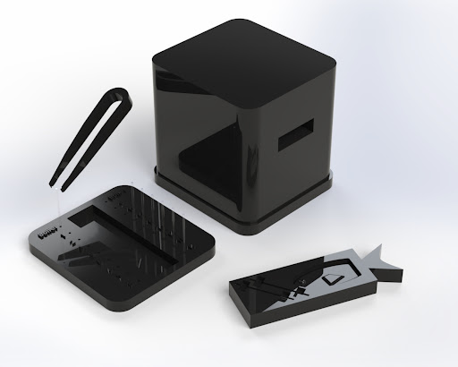

# O.C.E.A.N. – Open-Hardware Concentration Estimation and Numeration

> 

### What is O.C.E.A.N.?

O.C.E.A.N. stands for Open-Hardware Concentration Estimation and Numeration.

O.C.E.A.N. is a low-cost, open-hardware device for measuring the concentration of liquid samples for cryogenic processing

### Why is concentration measurement important?

Concentration measurements ensure quality management at several crucial steps in the cryopreservation process.

### What is Open-Hardware?

Open-hardware is an emerging movement in scientific research that aims to create freely available, iterative, and community-based designs for manufacturing labware, thereby lowering cost barriers to research.

### Why is the cryopreservation of fish and aquatic species' germplasm important?

1. Food security

2. Biomedical research

3. Genetic Biodiversity

### What is a short summary of the project we worked on over the past year?

Open-hardware Concentration Estimation and Numeration, O.C.E.A.N., is an open-hardware device for measuring the cell concentration of fish germplasm samples to provide quality management in cryogenic research processes. The cryopreservation of fish and aquatic species’ germplasm is central to food security, biomedical research, and for maintaining genetic biodiversity. At present, the aquatic species cryopreservation process is impeded by the absence of low-cost, accessible devices for concentration measurement of low-volume samples. O.C.E.A.N. is an open-hardware device that seeks to address the current barriers to concentration measurement, as current methods may be expensive, time-intensive, and exclusive to select processing centers. Our device can be successfully used to generate a calibration curve for known concentrations. After generating this curve, the device makes it possible to measure the concentration of 5 µL fish sperm samples. The 3D Design files are openly available for download on GitHub, allowing for anyone with access to a 3D-printer, photocell, LED, and Arduino UNO board, to replicate and iterate on our results.
